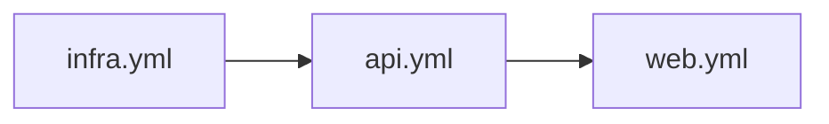

# TID Issuer Ansible

Automation for deploying the TID Issuer stack in two modes:

- split deployment on 3 target VMs (`infra`, `api`, `web`)
- full stack deployment on 1 target VM (`docker-env`)

## Playbooks

- `playbooks/site.yml`: split scenario orchestrator (`infra -> api -> web`)
- `playbooks/infra.yml`: Docker + platform stack (PostgreSQL, Keycloak, MinIO)
- `playbooks/api.yml`: Quarkus API as `systemd` service
- `playbooks/web.yml`: Vue build + Nginx reverse proxy
- `playbooks/docker-env.yml`: single-host full stack via Docker Compose



## Inventory

- `infra_hosts` -> `infra-server`
- `api_hosts` -> `api-server`
- `web_hosts` -> `front-server`
- `docker_env_hosts` -> `docker-env` (`192.168.56.103`)

`ansible.cfg` already points to `hosts.yaml`.

## Secrets

Use vault file:

```bash
ansible-vault edit group_vars/secrets.vault.yml
```

Run with secrets:

```bash
ansible-playbook playbooks/site.yml --ask-vault-pass -e @group_vars/secrets.vault.yml
```

## How To Run

Split scenario:

```bash
ansible-playbook playbooks/site.yml --ask-vault-pass -e @group_vars/secrets.vault.yml
```

Single VM scenario:

```bash
ansible-playbook playbooks/docker-env.yml --ask-vault-pass -e @group_vars/secrets.vault.yml
```

Optional explicit inventory form:

```bash
ansible-playbook -i hosts.yaml playbooks/docker-env.yml --ask-vault-pass -e @group_vars/secrets.vault.yml
```

## Docker-Env Images

- API: `ghcr.io/vasilpap/tid-issuer-quarkus:latest`
- Web: `ghcr.io/vasilpap/tid-issuer-vue:latest`

## Notes

- Repositories are synced from `main`.
- Templates for env/systemd/nginx/compose are in `files/`.
